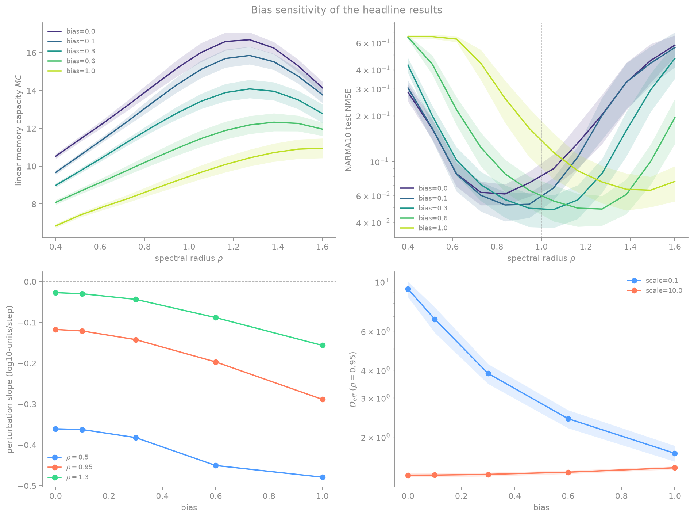
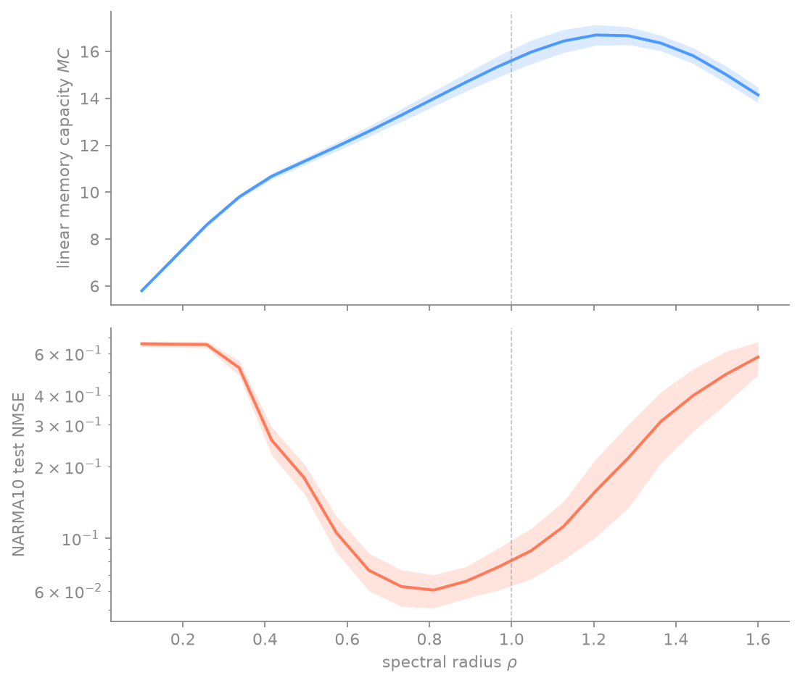
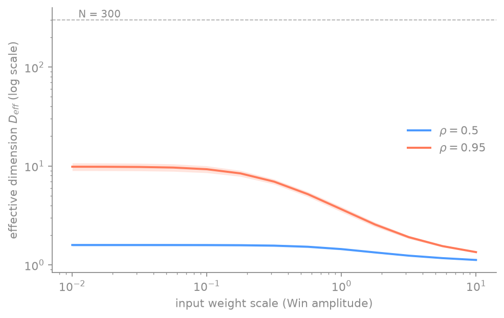
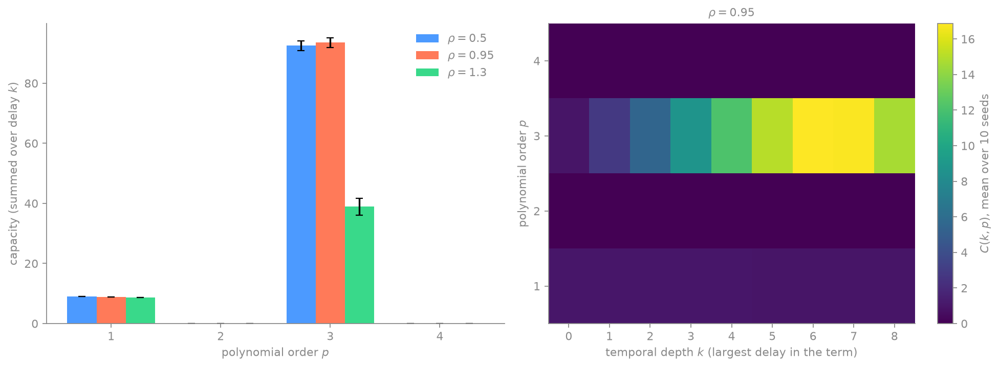

# reservoir-computing

**I built the smallest possible recurrent network I could train, and it disagreed with the rule everybody repeats.**

A from-scratch Echo State Network in pure NumPy — no reservoir-computing library, no
deep-learning framework, ~200 lines of actual algorithm. Then eight experiments to find
out what the thing is really doing.

This is a curiosity project. The goal was never a benchmark number; it was to watch
memory *appear* out of iterating a matrix, and to check the folklore against measurement.

---

## The idea in one paragraph

Training a recurrent network is expensive and fragile: gradients have to travel backwards
through time and they explode or vanish on the way. Reservoir computing refuses to play.
Take a **random, fixed** recurrent network. Never train it. Use it purely as an expander
that turns the history of an input signal into a high-dimensional state. Train **only a
linear readout** on top.

Because the only trainable part is linear, training stops being gradient descent and
becomes **ridge regression** — one linear solve, closed form, no learning rate, no local
minima.

```
x[t+1] = (1-α)·x[t] + α·tanh(W·x[t] + W_in·u[t] + b)      ← fixed, random, never trained
ŷ[t]   = W_out · x[t]                                      ← the only thing that learns
```

---

## Four things the measurements say that the tutorials don't

The first three were measured at `bias = 0.0` — the implicit default everywhere in this
project, until finding 4 showed what that default was costing. All three were then
re-measured across a bias sweep. **One survived unchanged, one broke down, one largely
dissolved.** Each carries its verdict below; the full sweep is in
[`RESULTS.md`](RESULTS.md).



### 1. "Set spectral radius to 0.99 because edge of chaos" is wrong in both directions



Linear memory capacity peaks at **ρ ≈ 1.20–1.21**. The NARMA10 error bottoms out at
**ρ ≈ 0.80**. The two optima sit on *opposite sides* of ρ = 1, about 0.4 apart.
ρ = 1 is optimal for neither task.

There is no good value of ρ. There is a good value *per task*, because memory and
nonlinearity compete for the same budget.

> **Holds at `bias = 0` only.** Sweeping the bias closes the gap monotonically
> (0.436 → 0.436 → 0.218 → 0.109 → 0.109 at bias 0, 0.1, 0.3, 0.6, 1.0), and by
> bias = 0.6 both optima sit *above* ρ = 1. The "opposite sides" framing is largely an
> artifact of a bias nobody chose. The underlying trade-off — memory and nonlinearity
> competing for one budget — survives; the geometry around ρ = 1 does not.
> Caveat on precision: the sweep's ρ grid has a step of 0.109, so the final gap is a
> single grid cell and the exact argmin is not resolved. The lowest sampled means move
> above 1; this is descriptive, not a statistical equivalence or significance claim.

### 2. ρ = 1.3 is not chaotic — it contracts

Twin-trajectory test: same input, initial states separated by ε = 10⁻⁹, measure whether
the gap grows.

| ρ | fitted slope (log₁₀ / step) | verdict |
|---|---|---|
| 0.50 | −0.361 | contracts |
| 0.95 | −0.117 | contracts |
| 1.30 | −0.027 | **still contracts** |

All three converge. The input drives neurons into the flat regions of the `tanh`, the
effective contraction rises, and the driven system keeps its Echo State Property well
past ρ = 1 — which is exactly why memory capacity was still climbing there in the plot
above. The spectral radius of `W` is a hint, not a criterion. Measure it instead.

This is the empirical version of Yildiz, Jaeger & Kiebel (2012).

> **The one that survived.** Re-measured at bias 0.1, 0.3, 0.6 and 1.0, all three slopes
> stay negative, and ρ = 1.3 gets *more* contracting, not less (−0.027 → −0.156). This
> result does not depend on the bias default. It is the most robust thing in this repo.

### 3. A 300-neuron reservoir was using nine dimensions



Effective dimension (participation ratio of the state covariance) collapses from
**9.28** at input scaling 0.1 to **1.35** at scaling 10 — out of **N = 300**.
Strong input saturates the `tanh`, every neuron synchronises, and the reservoir
flattens to essentially one dimension.

Input scaling is the least-tuned knob in the field and it silently decides how much of
your network exists.

> **Mostly dissolves with a nonzero bias.** The collapse ratio falls from 6.89× at
> bias = 0 to 1.16× at bias = 1.0 (D_eff 1.69 → 1.45 across the same input-scale range).
> A large bias is itself a saturating drive, so it pre-empts most of the collapse before
> any large input arrives. The knob still matters — but "input scaling decides how much
> of your network exists" is a statement about a zero-bias network.

### 4. A default nobody chose was switching off half the capacity spectrum



Linear memory capacity is one row of a bigger object. Dambre et al. (2012) decompose the
*total* capacity of a dynamical system by polynomial order `p` and temporal depth `k`.
Measuring the whole `C(k, p)` spectrum here, with a normalised Legendre basis, every
**even** order came out **exactly zero**. Not small — zero, to floating point.

That is not a bug in the measurement; it is a property of the network. With `tanh` (odd),
`bias = 0`, `x0 = 0` and symmetric input, flipping the sign of the entire input sequence
flips the sign of every state exactly, by induction through the update equation. So every
linear readout without its constant intercept is an **odd** functional of the input
history, while a degree-`p` basis function picks up `(−1)^p`. An odd predictor cannot correlate with a
centred even target in the population under symmetric input; the intercept cannot
change that covariance. Finite-sample correlations need not vanish: the exact zeros
reported here are observed clipped test-R² estimates, not a finite-sample guarantee.
The state symmetry itself was measured directly:

```
max |x(−u) + x(u)|,  bias = 0.0  :  0.000e+00     the state is exactly odd
max |x(−u) + x(u)|,  bias = 0.3  :  1.712e+00     symmetry broken
```

Break the symmetry and the missing half appears:

| bias | p = 1 | p = 2 | p = 3 | total |
|---|---|---|---|---|
| 0.0 | 6.93 | **0.00** | 59.93 | 66.86 |
| 0.3 | 6.94 | **24.93** | 52.56 | 84.43 |

`bias = 0.0` is the default in `esn.run_esn` and the original figure scripts used it
without passing the argument. **For the symmetric-input measurements, this suppresses
even-order population capacity.** NARMA10 is an exception: its input is Uniform[0, 0.5],
so the symmetry argument does not apply. Turning on bias raised total measured
capacity by 26% in the symmetric-input comparison above.

Before believing the large odd-order numbers, they were checked against a noise floor:
rebuild the basis functions from an **independent** input the reservoir never saw, and
capacity should vanish. It does — total 99.18 with the real input, **exactly 0.00** with
the surrogate, across all 714 basis functions. This control supports the odd-order
signal; it does not guarantee a zero surrogate estimate in every finite sample.

---

## Why this matters more than it looks

Dambre et al. (2012) proved that the total information processing capacity of a fading-memory
dynamical system is bounded by the number of linearly independent state variables:

```
C_total = Σ C[z]  ≤  N
```

This is a population projection bound for an orthonormal target family. The finite-sample
ridge readouts and clipped held-out R² sums used here are estimates, not quantities
guaranteed to obey that bound exactly in every sample.

Measured peak here: **MC ≈ 16.7 against a ceiling of N = 300**. The reservoir is using
roughly **5% of the capacity theory allows it**.

> **That 5% was an artifact of measuring one row.** `MC` counts only the **linear** part
> of the capacity spectrum, while the bound sums over *every* polynomial order. Finding 4
> measured the rest: inside the window `p ≤ 4, k ≤ 8`, the linear row is **8.8** but the
> total is **≈ 102** — the linear part is under 10% of what that same window already
> contains, and the window itself is a partial sum of an in-principle infinite basis. The
> reservoir was never using 5% of its ceiling. The instrument was looking at one row of
> the spectrum and comparing it against the bound on all of them.

That bound reframes the question this project is heading towards. Running the *Drosophila*
connectome (FlyWire, 139,255 neurons; MaleCNS v1.0, 166,700) and a degree-preserving null
model as reservoirs at matched N gives them the same upper bound, **not equal actual
totals**. Topology can change both the measured total and its distribution between
linear memory and nonlinearities of different order, without exceeding that shared ceiling
in the population.

So the interesting question is not "does the fly win?" but **"where does the fly spend its
capacity budget, and how close to N does it get?"**

---

## Quickstart

Requires [uv](https://docs.astral.sh/uv/). Nothing else.

```bash
git clone https://github.com/FullFran/reservoir-computing
cd reservoir-computing

uv run pytest -q                                  # 20 tests, ~0.6 s
uv run python experiments/fig_memory_curve.py     # regenerate one figure
for f in experiments/fig_*.py; do uv run python "$f"; done   # regenerate all ten
```

Every experiment fixes its seeds. Curves are averaged over 10 seeds and plotted with
their spread — a result without dispersion is not a result.

---

## What's in here

```
src/esn.py           reservoir construction, leaky-integrator update, ridge readout
src/tasks.py         delayed memory, delayed product, NARMA10
src/metrics.py       NMSE, R², memory capacity, effective dimension, perturbation growth
src/capacity.py      Legendre basis, C(k, p) information processing capacity spectrum
experiments/         ten scripts, one per figure
figures/             the ten figures, regenerable from scratch
tests/               spectral radius exactness, NARMA10 ground truth, ridge recovery,
                     Legendre orthonormality, capacity noise floor, Dambre bound
RESULTS.md           every measured number, with the conditions that produced it
notes/index.html     illustrated study notes (Spanish) — open it in a browser
```

### `notes/index.html`

Thirteen sections from the minimal ESN to the connectome question, with rendered
equations, hand-drawn diagrams and every figure in this repo. Fully self-contained:
fonts embedded, MathJax vendored, **works offline with no network access**.
Written in Spanish; the code and this README are English.

---

## A bug worth writing down

The first forgetting curve came out non-monotonic, which is physically impossible for a
fading-memory system. Cause: `run_esn` stored the state *before* consuming `u[t]`, so the
k = 0 memory task was being asked to reconstruct an input the state had never seen.

`states[t]` must reflect `u[t]`. An off-by-one in an index convention, invisible in the
tests that existed, and it produced a plot that looked plausible enough to publish.
That's the interesting kind of bug.

The bias default in finding 4 is the same family, one level worse. The off-by-one made a
plot look wrong to anyone who thought about it. `bias = 0.0` made nothing look wrong at
all — every figure was internally consistent, every test passed, and the network was
simply measuring half of what it could have. A wrong number announces itself eventually.
An unchosen default just quietly narrows what you are able to see.

---

## Where this goes next

The framing shift: a connectome-driven reservoir is not an attempt to build a fly-shaped
AI. It is a **measuring instrument**. You never train the network; you train linear probes
that ask the state a question:

> Which transformations of the input's past are implicitly available in the current state?

That turns "is the fly a good reservoir?" — a benchmark question with a boring answer —
into "what does this structure make easy to compute?"

### 1. The instrument is a capacity spectrum, not a single number

The original capacity measurements covered **linear** memory: reconstruct `u[t-k]` from
`x[t]`. The implemented IPC instrument now measures a finite window of the bigger object,

```
C(k, p)     k = temporal depth,  p = polynomial order of the transformation
```

Dambre et al. (2012) proved that the *total* capacity, summed over every order `p`, is
bounded by the number of linearly independent state variables. This repo originally
measured only the `p = 1` row and compared it against the all-orders ceiling — which is
why "MC ≈ 16.7 out of N = 300, so 5% of the ceiling" overstates the case. Finding 4 now
demonstrates nonlinear capacity within the measured window; capacity outside that
window remains unmeasured, not demonstrated waste.

Two observations still motivate using the broader instrument:

- `src/tasks.py:delayed_product` — the nonlinear memory probe `y[t] = u[t-k1]·u[t-k2]` —
  is defined and used by **nothing**. No experiment, no test.
- Linear memory capacity *exceeds* the effective dimension. Measured at the defaults
  (N = 300, ρ = 0.95, input scale 1.0, single seed): **MC = 14.77 but D_eff = 3.97**,
  while the numeric rank of the centred state matrix is the full **300**. The
  participation ratio weights directions by variance; low-variance directions still carry
  linearly recoverable information. `D_eff` is a description of where the variance sits.
  It is not a capacity ceiling and must not be read as one.

### 2. The constraint that decides whether any of this means anything

A spectrum `C(k, p)` is a property of three things, and only one of them is the fly:

```
C(k, p)  =  f( topology , dynamics , input statistics )
                 ↑           ↑              ↑
              the fly      our choice    our choice
```

This is not a footnote. Measured in this repo: holding `W` completely fixed and sweeping
only the input scaling moves `D_eff` from **9.28 to 1.35**. A knob we chose changes the
measured state structure by an order of magnitude.

So the protocol must fix the neuron model, leak rate, input scaling and input statistics
**once**, and apply that identical protocol to the fly and to every null model. Any result
is then stated as "this connectivity, under this family of dynamics, has these
properties" — never as "we found out what the fly computes". `conn2res` (Suárez et al.,
2024) makes the same separation of architecture from dynamics, for the same reason.

### 3. What is already known, so we can check ourselves against it

| Work | What it established | What it leaves open |
|---|---|---|
| Dambre et al. 2012, *Sci Rep* | Total capacity is bounded by independent state variables; memory and nonlinearity trade off | — (this is the theory we measure against) |
| Suárez et al. 2024, *Nat Commun* — `conn2res` | Connectome-as-reservoir as a method; architecture and dynamics must be varied separately | — (this is the methodological template) |
| Costi, Hadjiivanov, Dold, Hale & Izzo 2025, *Biomimetics* | FlyWire (~104,909 neurons) as an ESN beats a standard ESN on **overfitting resilience**; both topology and weights contribute, **weights more than topology** | Controls stop at random topology / random / shuffled weights. No degree-preserving, clustering-preserving or cell-type-preserving nulls |
| Nat Commun 16:2748, 2025 | A scalar **linear** memory capacity from human connectomes tracks age, white-matter integrity, locus coeruleus signal and cognition (n = 636, replicated) | Only `p = 1`. The nonlinear orders of the spectrum are untouched |

Replicating these is the point, not a fallback. A result with a known answer is the only
kind you can grade yourself against.

### 4. The order of work

1. **Extend the nonlinear capacity baseline on random reservoirs.** `C(k, p)` is
   implemented with an orthonormal polynomial basis and measured at the reference ρ
   values. Next, extend the ρ sweep using this finite-window spectrum instead of only
   its first row. This instrument check needs no connectome.
   The first matched-topology comparison now finds higher held-out accuracy from the
   full grid than from order totals at all tested biases, across eight exploratory
   seed blocks (see the new subsection in `RESULTS.md`). Next, replicate the fixed
   comparison on fresh blocks; this does not yet select a bias or isolate topology
   from post-normalization weight statistics.
2. **The 2×2 replication.** Topology (fly / random) × weights (fly / random), on the
   mushroom body rather than the whole brain, so it runs on a laptop. Question: does
   "weights matter more than topology" reproduce at this scale, under our protocol?
3. **The null ladder — reordered.** The previous plan opened with degree-preserving
   rewiring. The 2025 result says weights are the stronger contributor, so weight- and
   strength-preserving nulls go first, then degree-preserving rewiring, then clustering
   and modularity, then cell-type composition. Test the strong factor first.
4. **Lesioning, at the right granularity.** `ΔC = C(W) − C(W₋ᵢ)` is the natural
   question, but one lesion per neuron at N ≈ 10⁵ is not expensive, it is impossible:
   `fig_heatmap.py` is 1,440 trials at N = 300 and already takes minutes. Lesion **cell
   types and neuropils** — tens to hundreds of units — or estimate `ΔC` perturbatively.
5. **The bridge to plasticity.** With a learned `W₁ = W₀ + ΔW`, measure
   `ΔC(k, p) = C₁(k, p) − C₀(k, p)`: what does learning do to the capacity budget, and
   does it redistribute rather than add? This is where this repo meets the engram
   project — and it is downstream of a plasticity model that does not exist yet, so it
   is last, not first.

### 5. Two traps to stay out of

- **Comparing regions of different size.** Capacity is bounded by the number of
  independent state variables, so mushroom body vs central complex vs visual system in
  raw `C` measures size as much as organisation. Matched-N subsampling, or don't compare.
- **Reading dynamics as biology.** A good NARMA10 score from a fly-shaped `W` and a
  `tanh` we picked says nothing about what a fly computes. The connectome gives roughly
  `W`. It does not give neuron dynamics, synaptic dynamics, neuromodulation, plasticity
  or internal state.

---

## References

1. **Jaeger, H.** (2001). *The "echo state" approach to analysing and training recurrent neural networks.* GMD Report 148.
2. **Maass, W., Natschläger, T. & Markram, H.** (2002). *Real-time computing without stable states.* Neural Computation 14(11).
3. **Lukoševičius, M.** (2012). *A practical guide to applying echo state networks.* In *Neural Networks: Tricks of the Trade*.
4. **Dambre, J., Verstraeten, D., Schrauwen, B. & Massar, S.** (2012). *Information processing capacity of dynamical systems.* Scientific Reports 2, 514.
5. **Yildiz, I. B., Jaeger, H. & Kiebel, S. J.** (2012). *Re-visiting the echo state property.* Neural Networks 35.
6. **Appeltant, L. et al.** (2011). *Information processing using a single dynamical node as complex system.* Nature Communications 2, 468.
7. **Suárez, L. E., Mihalik, A., Milisav, F., Marshall, K., Li, M., Vértes, P. E., Lajoie, G. & Misic, B.** (2024). *Connectome-based reservoir computing with the conn2res toolbox.* Nature Communications 15, 656.
8. **Costi, L., Hadjiivanov, A., Dold, D., Hale, Z. F. & Izzo, D.** (2025). *The Drosophila connectome as a computational reservoir for time-series prediction.* Biomimetics 10(5).
9. **Mijalkov, M., Storm, L., Zufiria-Gerbolés, B. et al.** (2025). *Computational memory capacity predicts aging and cognitive decline.* Nature Communications 16, 2748.

---

## Licensing

- **Code, figures and notes text** — MIT, see [LICENSE](LICENSE).
- **Photographs in `notes/img/`** — third-party, CC BY 2.0 / CC BY-SA 2.5 / CC BY-SA 4.0.
  Per-image source, licence and required attribution in [`notes/img/CREDITS.md`](notes/img/CREDITS.md).
- **`notes/vendor/tex-svg.js`** — MathJax 3.2.2, Apache-2.0, vendored so the notes render offline.
- **Fonts embedded in `notes/index.html`** — Bricolage Grotesque, Newsreader and JetBrains Mono,
  SIL Open Font License 1.1.
